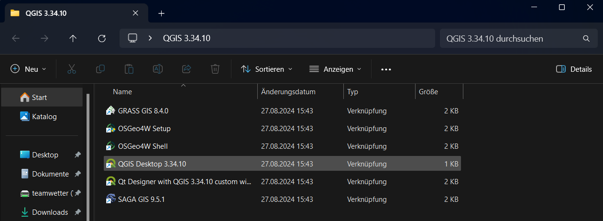
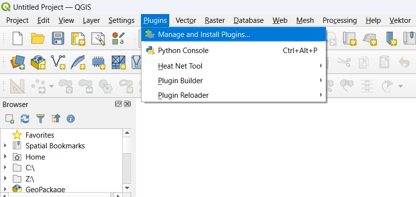
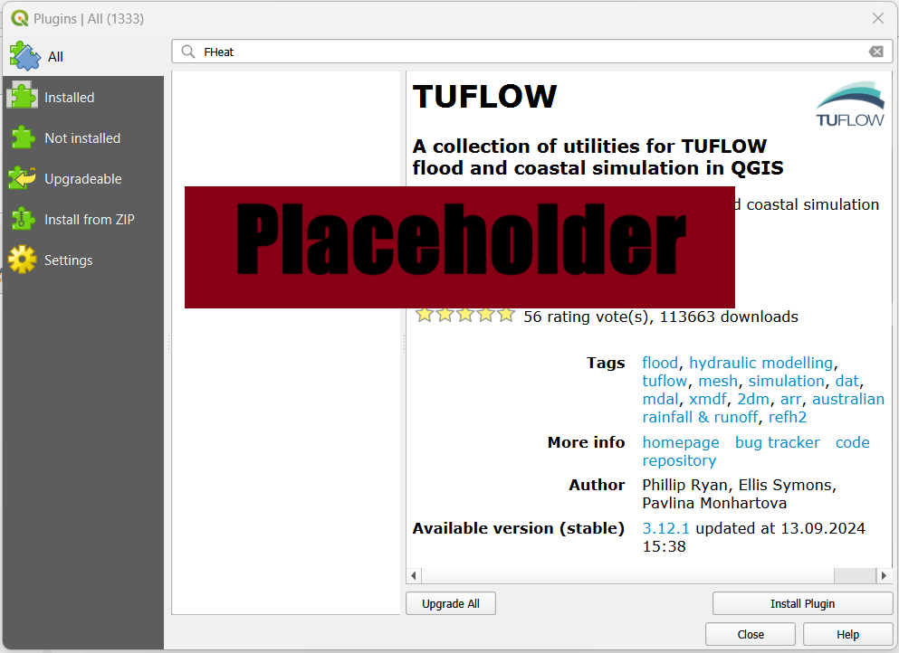
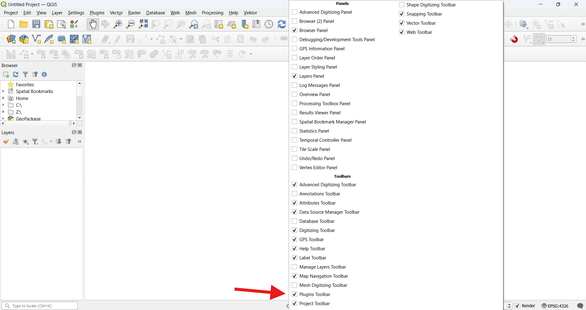
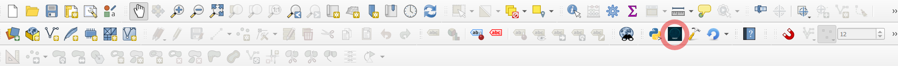
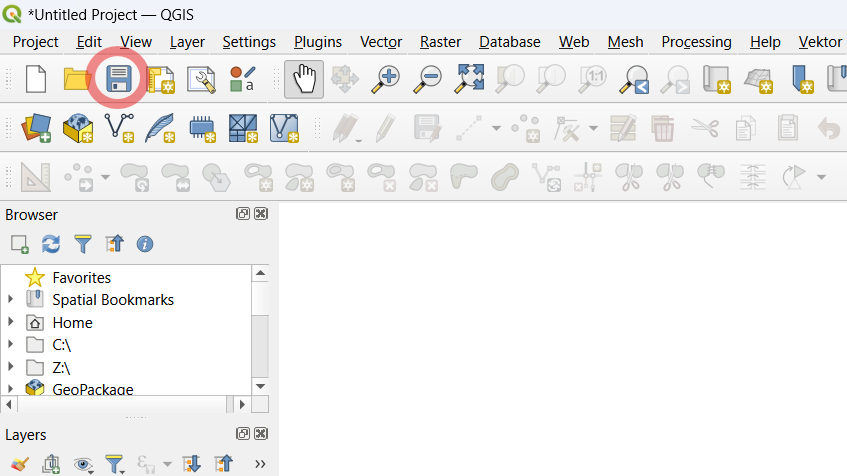
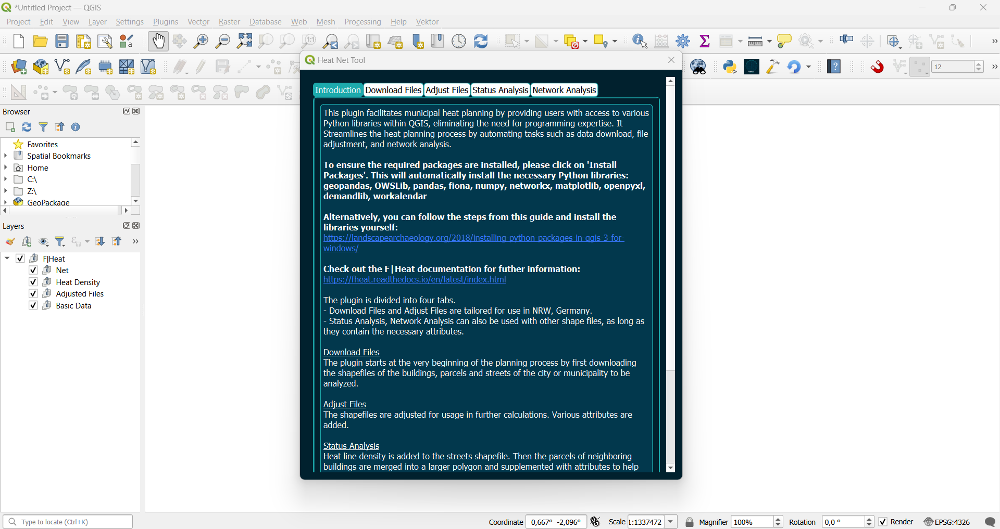

Installation
============
.. attention::
    If QGIS and Python is already installed on the system, please go directly to :ref:`quick-start` section. 

To use this software Python and QGIS has to be installed on your system. The application is currently tested for Python versions > 3.9 and QGIS version > 3.3.

QGIS Installation
-----------------

Go to `qgis.org <https://qgis.org/>`_ and download the current version for your system.

Python Installation
-------------------

The Plugin provides a function to automatically install the required python packages. Therefore python has to be installed on your device. Go to `python.org <https://www.python.org/downloads/>`_ and download the current version for your system (Windows, macOS, Linux).
Follow the instructions for installation for installation. If you want to install the required packages manually you can skip the python download.

.. attention::
    Make sure to check the box for adding Python to PATH.
    .. figure:: images/python_to_path.png
    :alt: Python_to_path.png
    :width: 50 %
    :align: center

Plugin Installation
-------------------

After installing Python and QGIS the plugin, as an extension of QGIS, has to be installed finally.

#. Official extension from QGIS:

Once QGIS is installed, open QGIS Desktop.

Click on "Plugins" > "Manage and Install Plugins..."

Select "All", search for "FHeat" and install the Plugin.

If the plugin toolbar is not visible, right-click on an empty space in the toolbar and check the "Plugin Toolbar" box.

The plugin toolbar with the F|Heat icon will then become visible.

It is advisable to save the project before starting F|Heat, as the plugin utilizes the project directory to save files. The project can be saved by clicking the save icon or by selecting "Project" > "Save As...".

F|Heat starts by clicking the icon in the toolbar.

    * Open the QGIS application.
    * Open the `Extension` panel.
    * Click on `Manage and install extensions...`.
    * Go to `All`.
    * Type `Heat Net Tool` in the search bar.
    * Click on `Install Extension`.
    * Check the box for `Heat Net Tool` in the list.
    * A widget should appear next to the python console widget.
    * Click on it and a new window should appear.
    * Press the `Install packages` button for installing the required dependencies.
    * The terminal should open and the dependencies get installed.
    * If you get an empty prompt and everything is installed without error messages.
    * Close the terminal.
    * The plugin is ready.

.. warning::
    Do not close the terminal window during installation. Otherwise the process has to be repeated.

Congratulations, everything is set up. If you did not get any error messages you are ready to plan district heating networks for your desired planning region.

.. _quick-start:

Quick Start
===========

If you are already familiar with QGIS and Python and already on your system you just have to get the plugin (extension) to start the application.
There are two possible ways to use the application:

#. Official extension from QGIS (stable version):

    * Open the QGIS application.
    * Open the `Extension` panel.
    * Click on `Manage and install extensions...`.
    * Go to `All`.
    * Type `Heat Net Tool` in the search bar.
    * Click on `Install Extension`.
    * Check the box for `Heat Net Tool` in the list.
    * A widget should appear next to the python console widget.
    * Click on it and a new window should appear.
    * Press the `Install packages` button for installing the required dependencies.
    * The terminal should open and the dependencies get installed.
    * If you get an empty prompt and everything is installed without error messages.
    * Close the terminal.
    * The plugin is ready.

#. Install via zip-folder (development version):

    * Extract the plugin from the current Github repository.
    * Install via the option `Install from zip-folder`.
    * Continue from step 8 in the first option.

Manual Instructions
-------------------

We provide also a german instruction paper where all steps and the underlying structure of the methodology is explained.

.. note::
    German version of the installation process will be added soon.
